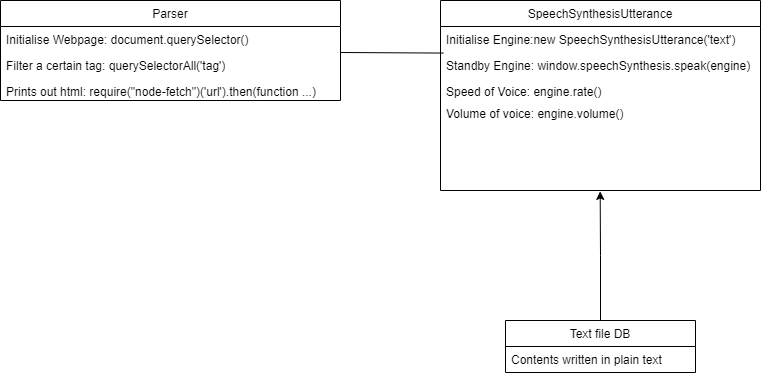

# **Orbital 2021**

## Team buttersmarsh (Gemini)

### Project Problem

The current existing voiceover/ text-to-speech apps for the visually impaired are not streamlined. Often, times, they read out [irrelevant html tags](https://www.bbc.com/news/world-us-canada-49694453), and may offer [no flexibility in terms of browsing](https://qz.com/1407450/theres-already-a-blueprint-for-a-more-accessible-internet/). Furthermore, current screen readers do not offer additional functionality in terms of [ad management](https://qz.com/1800064/for-blind-facebook-users-ads-havent-been-labeled-as-ads/).

### Solution

As such, our team aims to make a chrome web extension with additional features for the visually impaired, providing a more streamlined experience for users. The extension will inject itself and work on activation when viewing a webpage. It avoids reading irrelevant html tags and categorize them accordingly for easier navigation.

The unique feature of our app would be ad detection. Users are provided the ability to mark ads to prevent them from popping up again, and add them to a list.

The ultimate aim is to make the internet a more inclusive and accessible environment for all.

### Features

- Easy to use and change settings
- Interface for both visually impaired and sighted users to navigate
- Out of the box
- Lightweight and will not hinder with other background processes
- Ability to skip ads and provide a cache system to keep track of blacklisted ads
- Able to fast forward or go back on the go to skip unnecessary text blocks

### System Design

Small text file containing a filter list from [EasyList](https://easylist.to/) to keep track of html tags to mark as ads.

Acts as a 'backend', with its aim to be lightweight.

### Pipeline

**User Flow:**

**Class Diagram:**

### Development Plan 

**<u>Milestone 1 (Ideation): *31st May*</u>**

 - Learn more about the different APIs used
 - Learn more about web browser programming
 - Preliminary research on Machine Learning Tools
 - Gathering feedback on current implementations

**<u>Milestone 2 (Prototype): *28th June*</u>**

 - Able to filter out nested tags
 - Application is ready for production but still at the alpha stage
 - Base settings are configured
 - Experiment with users to gain feedback

**<u>Milestone 3 (Extension): *26th July*</u>**

 - Clean up existing features
 - Make code more streamlined
 - Package for production

### Relevant Tools

Our project will use a number of languages and libraries:

- HTML, CSS, JavaScript
- NodeJS
- SpeechSynthesisUtterance 
